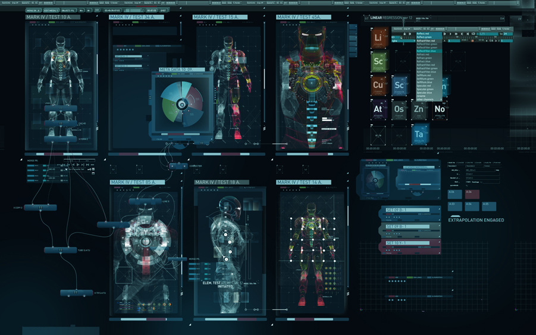

# SciFi UI Project

Name: Wiktoria Uramowska

Student Number: C17742751

# Description of the assignment

As part of Object Oriented Programming assignment we were required to create a Scifi inspired UI using Java and Processing.
The aim of the assignment was not only to test our ability of creative coding but also the knowledge of using OOP concepts 
such as polymorphism, abstraction or inheritance.
We could take an inspiration from any of the SciFi movies that we have watched or heard about.
When I was thinking about how I want my UI to look like, the first thing that came to my mind was the interface in Iron Man suit.
Whenever Tony Stark is using his Iron Man suit, he can see all the important information right under the mask.
That is where I decided to take my inspiration from. 
The UI I decided to create consists of two 'pages', in the way that whenever the program starts running first thing required to do by the user is to enter their name,
thanks to that feature anyone can use it and make it a little bit more personal! (Well, hopefully that will work..)

I don't want to keep you waiting any longer, clone the repo, run it and enjoy!

# Instructions

# How it works

# What I am most proud of in the assignment

The thing I am most proud of is the fact that I actually managed to pull that off!
When I heard about the assignment for the first time, I was not too happy about it I must admit, as I am not that much into gaming and SciFi, 
but when I started to work on it, the more time I've spent with the code the more I enjoyed it.
Processing is fun after all!

# Markdown Tutorial

This is *emphasis*

This is a bulleted list

- Item
- Item

This is a numbered list

1. Item
1. Item

This is a [hyperlink](http://bryanduggan.org)

# Headings
## Headings
#### Headings
##### Headings

This is code:

```Java
public void render()
{
	ui.noFill();
	ui.stroke(255);
	ui.rect(x, y, width, height);
	ui.textAlign(PApplet.CENTER, PApplet.CENTER);
	ui.text(text, x + width * 0.5f, y + height * 0.5f);
}
```

So is this without specifying the language:

```
public void render()
{
	ui.noFill();
	ui.stroke(255);
	ui.rect(x, y, width, height);
	ui.textAlign(PApplet.CENTER, PApplet.CENTER);
	ui.text(text, x + width * 0.5f, y + height * 0.5f);
}
```

This is an image using a relative URL:




This is an image using an absolute URL:


This is a youtube video:

[](https://www.youtube.com/watch?v=J2kHSSFA4NU)

This is a table:

| Heading 1 | Heading 2 |
|-----------|-----------|
|Some stuff | Some more stuff in this column |
|Some stuff | Some more stuff in this column |
|Some stuff | Some more stuff in this column |
|Some stuff | Some more stuff in this column |

